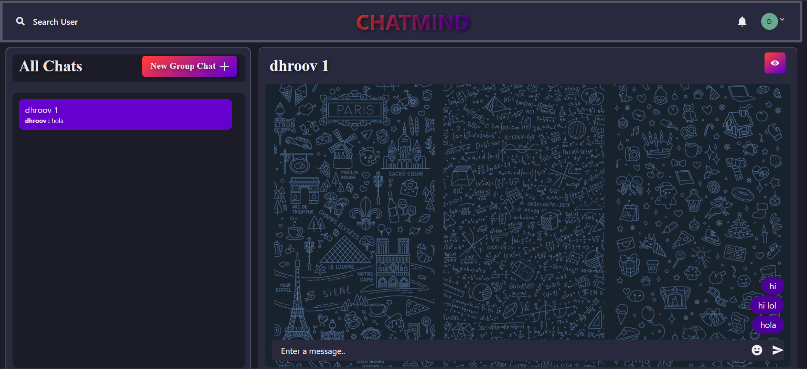
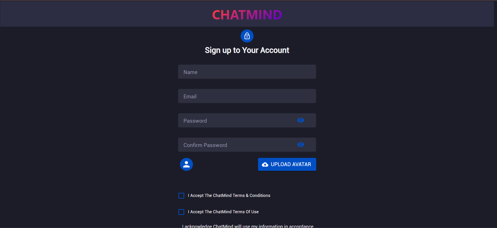
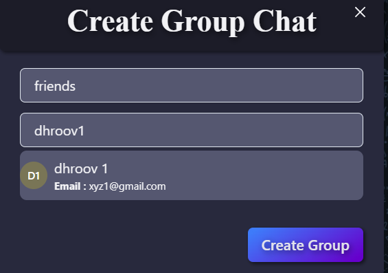
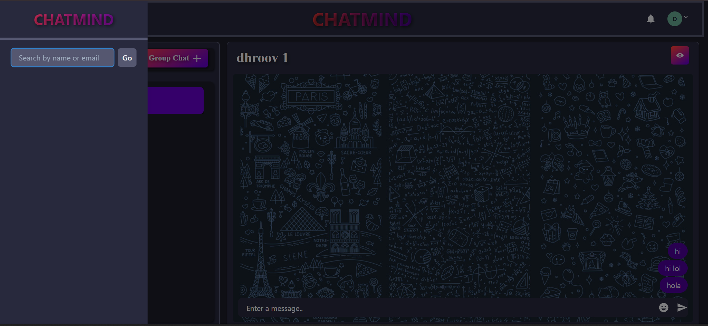

# 💬 ChatMind – Real-Time Chat Application

ChatMind is a full-stack real-time chat application built using the MERN stack. It enables users to communicate through one-to-one and group conversations with secure authentication, instant messaging, and an intuitive user interface.

The project follows a client-server architecture with a React frontend, Express/Node.js backend, MongoDB database, and Socket.IO for real-time communication.

---

## 🚀 Features

- 🔐 Secure JWT-based Authentication
- 👤 User Registration & Login
- 💬 One-to-One Chat
- 👥 Group Chat
- 🔍 Search Users
- 📝 Create & Manage Groups
- 👤 User Profile Management
- ⚡ Real-Time Messaging using Socket.IO

---

## 🛠️ Tech Stack

### Frontend
- React.js
- Chakra UI
- Context API
- Axios
- Socket.IO Client

### Backend
- Node.js
- Express.js
- JWT Authentication
- bcrypt.js
- Express Middleware

### Database
- MongoDB
- Mongoose

### Cloud & Storage
- Cloudinary

### Real-Time Communication
- Socket.IO

---

## 📸 Screenshots

> - Login Page
 

 
> - Sign Up Page
 

 
> - Chat Interface
 

 
> - Group Chat
 

 
> - User Search
 

---
